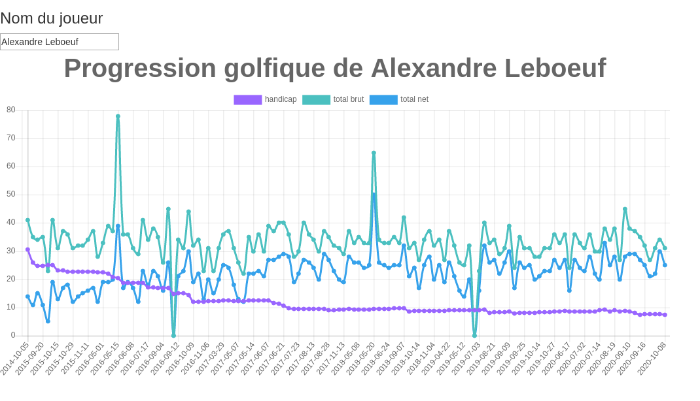
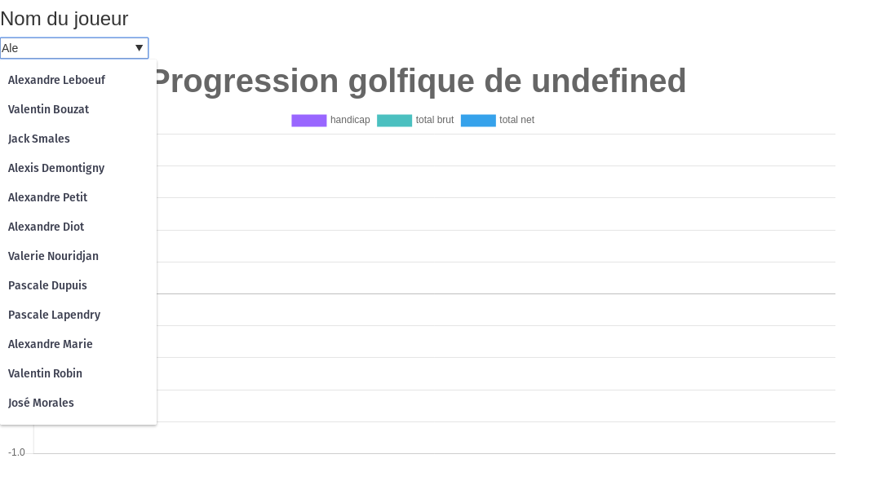

# PARTIE 1 ET 2 
## Extraction des résultats et stockage dans la base de données
#### Les url sont récupérés au début d'[index.php](./index.php) puis transmise dans une fonction récupérant tous les golfeurs d'une compétition et retournant un tableau d'objet [golfeur](./golfeur.php)
Tous les objets sont ensuite stockés dans la base grace au [singleton](./Saingleuton.php)
### fichier : [index.php](./index.php)

```php
require_once("./Golfeur.php");
require_once("./Saingleuton.php");
$pedro = new Golfeur('Pedro', 'Sanchez');
$db = Saingleuton::getInstance();


$temp = file_get_contents("https://web.ffgolf.org/resultats/listcompet.php?pub=1&gk=d73c6130810543df7e7caf183b7b62d2");
$temp = preg_split('/var cpt/', $temp);
$temp = preg_split('/\$\(document\).ready/', $temp[1])[0];
$temp = substr($temp,5, strlen($temp)-10);
$temp = preg_split('/\[\"/', $temp);
array_shift($temp);
$id_golfeur = 1;
foreach($temp as $id_compet => $compet){
    if(strpos(strval($compet), "Simple") != false){
        $compet = preg_split('/,"/', $compet);
        $lien = substr($compet[0], 0, strlen($compet[0])-1);
        $competName = substr($compet[1], 0, strlen($compet[1])-1);
        $competDate = substr($compet[4], 0, strlen($compet[4])-4);
        $db->insertCompet($id_compet+1, $competName, $competDate);
        $golfeurs = $pedro->getInfos("https://web.ffgolf.org/resultats/".$lien);

        foreach($golfeurs as $golfeur){
            $db->insertGolfeur($golfeur->getNom());
            $db->insertResultat($golfeur->getNom(), $id_compet+1, $golfeur->getTN(), $golfeur->getTB(), $golfeur->getTotalN(), $golfeur->getTotalB(), $golfeur->getIdx());
            $id_golfeur++;  
        }

    }
    
}
```

### fichier : [Saingleuton.php](./Saingleuton.php) pour la partie PDO
### **C'est une base de données postgreSQL**

```php

<?php

class Saingleuton
{
	private $PDOInstance = null;
	private static $instance = null;

	private function __construct()
	{
		$this->PDOInstance =   new PDO("pgsql:host=localhost;port=5432;dbname=golfeur", 'postgres', 'postgres', array(
			PDO::ATTR_EMULATE_PREPARES => false,
			PDO::MYSQL_ATTR_DIRECT_QUERY => false,
			PDO::ATTR_ERRMODE => PDO::ERRMODE_EXCEPTION
		));
	}

	public static function getInstance()
	{
		if (is_null(self::$instance)) {
			self::$instance = new Saingleuton();
		}
		return self::$instance;
	}


	public function insertGolfeur($nom)
	{
		$query = $this->PDOInstance->prepare('select nom from golfeur where nom = ?');
		$query->bindValue(1, $nom);
		$query->execute();
		if ($query->rowCount() == 0) {
			$query = $this->PDOInstance->prepare('insert into golfeur(nom) values(?)');
			$query->bindValue(1, $nom);
			$query->execute();
		}
	}

	public function insertCompet($id, $nom, $date)
	{
		try {
			$query = $this->PDOInstance->prepare('insert into compet(nom, date, id) values(?,?,?)');
			$query->bindValue(1, $nom);
			$query->bindValue(2, $date);
			$query->bindValue(3, $id);
			$query->execute();
		} catch (Exception $e) {
			echo 'Exception compet -> ';
			var_dump($e->getMessage());
		}
	}

	public function insertResultat($nom_golf, $id_compet, $tn, $tb, $totaln, $totalb, $idx)
	{
		try {
			$id_golf = $this->PDOInstance->prepare('select id from golfeur where nom = ?');
			$id_golf->bindValue(1, $nom_golf);
			$id_golf->execute();
			$id_golf = $id_golf->fetchAll()[0][0];
			$id_golf = strval($id_golf);
			$query = $this->PDOInstance->prepare('insert into resultat(id_golfeur, id_compet, t1n, t2n, t3n, t4n, t1b, t2b, t3b, t4b, totalb, totaln, idx) values(?,?,?,?,?,?,?,?,?,?,?,?,?)');
			$query->bindValue(1, $id_golf);
			$query->bindValue(2, $id_compet);
			$query->bindValue(3, $tn[0]);
			$query->bindValue(4, $tn[1]);
			$query->bindValue(5, $tn[2]);
			$query->bindValue(6, $tn[3]);
			$query->bindValue(7, $tb[0]);
			$query->bindValue(8, $tb[1]);
			$query->bindValue(9, $tb[2]);
			$query->bindValue(10, $tb[3]);
			$query->bindValue(11, $totaln);
			$query->bindValue(12, $totalb);
			$query->bindValue(13, $idx);
			$query->execute();
		} catch (Exception $e) {
			echo 'Exception resulat-> ';
			var_dump($e->getMessage());
		}
	}

	public function getData($nom)
	{
		$query = $this->PDOInstance->prepare("SELECT golfeur.nom, idx, totaln, totalb, date FROM golfeur inner join resultat on resultat.id_golfeur = golfeur.id inner join compet on compet.id = resultat.id_compet where golfeur.nom=? order by date;");
		$query->bindValue(1, $nom);
		$query->execute();
		if ($query->rowCount() > 0) {
			while ($value = $query->fetch(PDO::FETCH_OBJ)) {
				$nom = $value->nom;
				$idx = $value->idx;
				$totaln = $value->totaln;
				$totalb = $value->totalb;
				$date = $value->date;
				$result_array[] = ['nom' => $nom, 'totaln' => $totaln, 'totalb' => $totalb, 'idx' => $idx, 'date' => $date];
			}
			return $result_array;
		}
		return $result_array;
	}

	public function getGolfeur()
	{
		$query = $this->PDOInstance->prepare("SELECT distinct nom from golfeur;");
		$query->execute();
		if ($query->rowCount() > 0) {
			while ($value = $query->fetch(PDO::FETCH_OBJ)) {
				$result_array[] = ['nom' => $value->nom];
			}
		}
		return $result_array;
	}
}
```
### On retrouve les fonctions insert* qui permettent d'enregistrer dans la BDD nos données, les fonctions get servent pour la partie 3  
<BR />

## fichier : [Golfeur](./golfeur.php) qui est donc la classe golfeur             
```PHP
<?php
class Golfeur{
    private $nom;
    private $idx;
    private $TB = [];
    private $TN = [];
    private $TotalB;
    private $TotalN;

    public function __construct($nom = null, $prenom = null, $idx = null, $totalPointsBruts = null){
        $this->nom = $nom;
        $this->idx = $idx;
    }

    public function getNom(){
        return $this->nom;
    }
    public function setNom($nom){
        $this->nom = $nom;
    }
    public function getIdx(){
        return $this->idx;
    }
    public function setIdx($idx){
        $this->idx = $idx;
    }
    public function getTB(){
        return $this->TB;
    }
    public function setTB($TB){
        $this->TB = $TB;
    } 
    public function getTN(){
        return $this->TB;
    }
    public function setTN($TN){
        $this->TN = $TN;
    } 
    public function getTotalN(){
        return $this->TotalN;
    }
    public function setTotalN($TotalN){
        $this->TotalN = $TotalN;
    } 
    public function getTotalB(){
        return $this->TotalB;
    }
    public function setTotalB($TotalB){
        $this->TotalB = $TotalB;
    }

    public function getInfos($url){
        $tempB = file_get_contents($url);
        $tempN = file_get_contents($url.'&res=N');
        $nb_joueur = $this->countMembers(preg_split("[<p>]", $tempB));
        $tempoB = preg_split("/<td class=mtdgris/", $tempB);
        $tempoN = preg_split("/<td class=mtdgris/", $tempN);
        $golfeurs = [];
        for($i=0, $count = 0;$i<$nb_joueur;$i++){
            $golfeur = new Golfeur();
            if($i%2 == 0){
                $names = $this->computeName($tempoB[$count+3]);
                $prenom = $names[0];
                $nom = implode($names, " ");
                $idx = $this->removeHtmlTag($tempoB[$count+4]);
                $T1B = $this->removeHtmlTag($tempoB[$count+6]);
                $T2B = $this->removeHtmlTag($tempoB[$count+7]);
                $T3B = $this->removeHtmlTag($tempoB[$count+8]);
                $T4B = $this->removeHtmlTag($tempoB[$count+9]);
                $T1N = $this->removeHtmlTag($tempoN[$count+6]);
                $T2N = $this->removeHtmlTag($tempoN[$count+7]);
                $T3N = $this->removeHtmlTag($tempoN[$count+8]);
                $T4N= $this->removeHtmlTag($tempoN[$count+9]);
                $deuxJB = preg_split("/<td class=mtdblanc/", $tempoB[$count+10]);
                $deuxJN = preg_split("/<td class=mtdblanc/", $tempoN[$count+10]);
                $TotalN = $this->computeTotal([$T1N, $T2N, $T3N, $T4N]);
                $TotalB = $this->computeTotal([$T1B, $T2B, $T3B, $T4B]);
                $a = [$T1B, $T2B, $T3B, $T4B];
                $b = [$T1N, $T2N, $T3N, $T4N];
                $golfeur->nom = $nom;
                $golfeur->idx = $idx ;
                $golfeur->TB = $a;
                $golfeur->TN = $b;
                $golfeur->TotalB = $TotalB;
                $golfeur->TotalN = $TotalN;
                $count+=10;
            }else{
                $names = $this->computeName($deuxJB[3]);
                $prenom = $names[0];
                $nom = implode($names, " ");
                $idx = $this->removeHtmlTag($deuxJB[4]);
                $T1B = $this->removeHtmlTag($deuxJB[6]);
                $T2B = $this->removeHtmlTag($deuxJB[7]);
                $T3B = $this->removeHtmlTag($deuxJB[8]);
                $T4B = $this->removeHtmlTag($deuxJB[9]);
                $T1N = $this->removeHtmlTag($deuxJN[6]);
                $T2N = $this->removeHtmlTag($deuxJN[7]);
                $T3N = $this->removeHtmlTag($deuxJN[8]);
                $T4N = $this->removeHtmlTag($deuxJN[9]);
                $deuxJB = preg_split("/<td class=mtdblanc/", $deuxJB[10]);
                $deuxJN = preg_split("/<td class=mtdblanc/", $deuxJN[10]);
                $TotalB = $this->removeHtmlTag($deuxJB[0]);
                $TotalN = $this->removeHtmlTag($deuxJN[0]);
                $a = [$T1B, $T2B, $T3B, $T4B];
                $b = [$T1N, $T2N, $T3N, $T4N];
                $golfeur->nom = $nom;
                $golfeur->idx = $idx ;
                $golfeur->TB = $a;
                $golfeur->TN = $b;
                $golfeur->TotalB = $TotalB;
                $golfeur->TotalN = $TotalN;
                
                }
            array_push($golfeurs, $golfeur);
        }
        return $golfeurs;
    }

    public function computeTotal($tab){
        $count = 0;
        foreach($tab as $value){
            if($value != '-' && $value != 'FOR'){
                $count+=intval($value);
            }
        }
        return $count;
    }
    public function removeHtmlTag($tab){
        $mdr = preg_split("['>]", $tab);
        $mdr = preg_split("[</]", $mdr[1])[0];
        return $mdr;
    }
    public function computeName($tab){
        $nom1 = preg_split("[CAPTION, ']",$tab);
        $nom1 = preg_split("[']", $nom1[1]);
        $nom1 = preg_split("[ ]", $nom1[0]);
        $prenom = $nom1[count($nom1) - 1];
        array_pop($nom1);
        $nom = implode($nom1," ");
        return [$prenom, $nom];
    }
    public function countMembers($tab){
        $tempoTab = 0;
       foreach($tab as $value){
           $tempoTab += preg_match_all("[img/flag]", $value, $matches);
       }
        return $tempoTab;
    }


}
```


# PARTIE 3
## Affichage des données via graphique chartjs 
## fichier : [index.html](./index.html)
```html
<!DOCTYPE html>
<html>

<head>
    <title>Esteban Zia thao les cités d'or</title>
    <link rel="stylesheet" href="https://maxcdn.bootstrapcdn.com/bootstrap/3.4.0/css/bootstrap.min.css">
    <script src="https://ajax.googleapis.com/ajax/libs/jquery/3.4.1/jquery.min.js"></script>
    <script src="https://maxcdn.bootstrapcdn.com/bootstrap/3.4.0/js/bootstrap.min.js"></script>
    <script src="http://cdnjs.cloudflare.com/ajax/libs/moment.js/2.13.0/moment.min.js"></script>
    <script src="https://cdnjs.cloudflare.com/ajax/libs/Chart.js/2.4.0/Chart.bundle.js"></script>
    <script src="./utils.js"></script>
</head>

<body>
    <h3>Nom du joueur</h3><input oninput="bernard()" id="select2" list="select">
    <datalist id="select">
    </datalist>
    <div style="width:75%;">
        <canvas id="canvas"></canvas>
    </div>

    <script type="text/javascript">
        $(document).ready(function () {
            $.ajax({
                url: "get_golfeur.php",
                method: "GET",
                success: function (data) {
                    options = "";
                    data = JSON.parse(data);
                    for (var i in data) {

                        options += "<option id='" + data[i].nom + "'>" + data[i].nom + "</option>";
                    }
                    document.getElementById('select').innerHTML = options;
                }
            });

        });

        function bernard() {
            nom = document.getElementById('select2').value;
            $.ajax({
                url: "get_data.php?nom=" + nom,
                method: "GET",
                success: function (data) {
                    var data = JSON.parse(data);
                    var nom = [];
                    var date = [];
                    var totaln = [];
                    var totalb = [];
                    var idx = [];

                    for (var i in data) {
                        nom.push(data[i].nom);
                        date.push(data[i].date);
                        totaln.push(data[i].totaln);
                        idx.push(data[i].idx);
                        totalb.push(data[i].totalb);
                    }

                    var config = {
                        type: 'line',
                        data: {
                            labels: date,

                            datasets: [{
                                    label: 'handicap',
                                    backgroundColor: window.chartColors.purple,
                                    borderColor: window.chartColors.purple,
                                    data: idx,
                                    fill: false,
                                },
                                {
                                    label: 'total brut',
                                    backgroundColor: window.chartColors.green,
                                    borderColor: window.chartColors.green,
                                    data: totalb,
                                    fill: false,
                                },
                                {
                                    label: 'total net',
                                    backgroundColor: window.chartColors.blue,
                                    borderColor: window.chartColors.blue,
                                    data: totaln,
                                    fill: false,
                                }
                            ]
                        },
                        options: {
                            responsive: true,
                            title: {
                                display: true,
                                text: 'Progression golfique de ' + nom[0],
                                fontSize: 40
                            },
                            tooltips: {
                                mode: 'index',
                                intersect: false,
                            },
                            hover: {
                                mode: 'nearest',
                                intersect: true
                            },
                            scales: {
                                xAxes: [{
                                    scaleLabel: {
                                        labelString: 'date'
                                    }
                                }],
                                yAxes: [{
                                    scaleLabel: {
                                        labelString: 'Value'
                                    }
                                }]
                            }
                        }
                    };

                    var ctx = document.getElementById("canvas").getContext("2d");
                    window.myLine = new Chart(ctx, config);
                },
                error: function (data) {
                    console.log(data);
                }
            });
        };
    </script>

</body>

</html>
```

On remplit une datalist via des requetes AJAX [get_golfeur.php](./get_golfeur.php) qui va automatiquement trier les joueurs au fur et à mesure qu'on remplira l'input  
A chaque changement dans l'input, une requete SQL [get_data.php](./get_data.php) est faite afin de savoir si le golfeur existe dans la base de donnéees si un joueur est trouvé alors il retournes les infos necessaire à l'affichage du graphique dans [index.html](./index.html) grâce à la fonction bernard();  
<br />
 

et lors de la recherche : 
<br />  



Il est marqué undefined mais que ce soit marqué undefined ou " " cela ne change pas grand chose